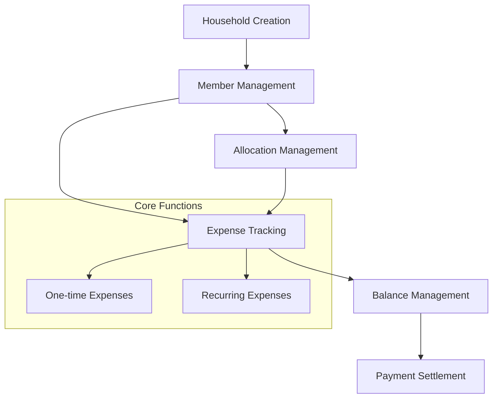

# RentNest Roommate Finance Manager

RentNest is a Clarity-powered solution that helps roommates transparently manage their shared financial obligations. It creates a trustless system for tracking rent payments, utility bills, and common expenses without requiring a single person to manage the group's finances.

## Overview

RentNest allows roommates to:
- Create a shared household account
- Set up and track recurring expenses (rent, utilities)
- Add one-time expenses
- Manage custom expense allocations
- Track running balances between roommates
- Settle payments transparently
- Record external payment settlements

## Architecture

The system is built around a core smart contract that manages household membership, expenses, and payment settlements. Here's how the components work together:



### Core Components:
- **Households**: Base unit for grouping roommates
- **Members**: Individual participants in a household
- **Expenses**: Both one-time and recurring financial obligations
- **Balances**: Running tallies between members
- **Settlements**: Payment resolution tracking

## Contract Documentation

### RentNest Core Contract (`rentnest-core.clar`)

The main contract handling all household management and financial operations.

#### Key Features:
- Household creation and management
- Member addition and removal
- Expense tracking (one-time and recurring)
- Custom expense allocation
- Balance tracking
- Payment settlement

#### Access Control:
- Household creators have admin privileges
- Members can add expenses and settle payments
- Only admins can add/remove members and update allocations

## Getting Started

### Prerequisites
- Clarinet installation
- Stacks wallet for deployment

### Basic Usage

1. Create a household:
```clarity
(contract-call? .rentnest-core create-household "123 Main St Apartment")
```

2. Add members:
```clarity
(contract-call? .rentnest-core add-member household-id member-address)
```

3. Add an expense:
```clarity
(contract-call? .rentnest-core add-one-time-expense household-id "Groceries" u100 "equal")
```

## Function Reference

### Household Management

```clarity
(create-household (name (string-ascii 100)))
(add-member (household-id uint) (new-member principal))
(remove-member (household-id uint) (member-to-remove principal))
```

### Expense Management

```clarity
(add-one-time-expense (household-id uint) (name (string-ascii 100)) (amount uint) (allocation-type (string-ascii 10)))
(add-recurring-expense (household-id uint) (name (string-ascii 100)) (amount uint) (recurrence-period uint) (allocation-type (string-ascii 10)))
```

### Payment Settlement

```clarity
(settle-payment (household-id uint) (to-member principal) (amount uint))
(record-external-payment (household-id uint) (settlement-id uint) (tx-id (buff 32)))
```

## Development

### Testing
1. Clone the repository
2. Install dependencies: `clarinet install`
3. Run tests: `clarinet test`

### Local Development
1. Start local chain: `clarinet console`
2. Deploy contracts: `clarinet deploy`

## Security Considerations

### Limitations
- Maximum 20 members per household
- Expense amounts must be positive integers
- Custom allocations must sum to 100%

### Best Practices
- Verify all member balances before removing them
- Ensure expense allocations are properly set before settlement
- Double-check payment amounts before settlement
- Record external payment transactions promptly

The system enforces validation checks for:
- Authorization and membership
- Valid expense amounts and allocations
- Sufficient balances for settlements
- Proper household administration